# Sensei - AI-Powered Knowledge Sharing Platform

*Bridge generations through AI personas and monetize your expertise*
=======
# 🌟 Sensei - Decentralized Knowledge Economy Platform

**Empowering Retirees & Experts Through AI-Powered Knowledge Sharing**


Sensei is a revolutionary decentralized platform that creates a thriving economy around knowledge sharing, where retirees and experts can register as "Senseis," create AI clones of themselves, and share their skills with the world forever. Students can book lessons, mint NFTs of their learning experiences, and participate in a knowledge-backed economy.

## 🎯 Revolutionary Vision

Sensei is a revolutionary Web3 platform that enables knowledge sharing through AI personas and blockchain-based monetization. The platform allows experts (Senseis) to create AI replicas of themselves and monetize their knowledge while students can learn from these AI mentors and earn/spend SensiTokens.

### Key Features

- **Role-Based Authentication**: Users choose between Sensei (expert) or Student roles
- **Wallet Integration**: Support for MetaMask, WalletConnect, and Coinbase Wallet
- **Sensei Registration**: Comprehensive onboarding for experts with profile creation
- **AI Persona Creation**: Transform your expertise into interactive AI replicas
- **Knowledge Economy**: Earn and spend SensiTokens through learning interactions
- **Lesson NFTs**: Mint and burn lesson NFTs with 50/50 revenue split
- **Categorized Marketplace**: Browse senseis by expertise categories
- **Token Management**: Built-in wallet for minting/burning SensiTokens
=======
**Building the World's First Knowledge-Backed Economy**: We believe that knowledge is the most valuable currency. Our platform creates a sustainable economic model where:


- **🧓 Retirees & Experts** register as Senseis and create AI replicas that preserve their knowledge forever
- **👨‍🎓 Students** can book lessons with anyone - no registration required, pay with ETH or SenseiTokens
- **💰 SenseiToken** is a floating stablecoin backed by knowledge transactions and learning value
- **🎨 Lesson NFTs** can be minted by anyone with 50/50 revenue split between student and sensei
- **🔒 Privacy Protection** through Zama FHEVM ensures sensei knowledge uploads are confidential
- **🤖 AI Replicas** learn from senseis and eventually become indistinguishable from the original sensei

## 🏗️ System Architecture

### 🚪 Gateway-First Design
**ALL interactions flow through the SenseiGateway contract** - ensuring seamless coordination between all platform components.

### Smart Contracts

1. **🏛️ SenseiGateway** - Central orchestration hub for all platform interactions
2. **👥 SenseiRegistry** - Manages Sensei profiles, AI replicas, and knowledge tracking
3. **💰 SenseiToken** - Floating stablecoin backed by knowledge economy transactions
4. **📅 BookingSystem** - Handles lesson booking with ETH or **any ERC20 token** (no student registration required)
5. **🎨 LessonNFT** - Creates mintable lesson NFTs with automated 50/50 revenue splits
6. **🤖 SensayAI** - Personal AI agents that learn and evolve for each Sensei
7. **🔒 PrivacyManager** - Zama FHEVM integration for confidential knowledge data protection

### Revolutionary Economic Model

- **🔄 Floating Stablecoin**: SenseiToken value adjusts based on knowledge demand and platform usage
- **⚡ Public Minting**: Anyone can mint tokens with ETH - no barriers to entry
- **🧠 Knowledge Backing**: Token value directly backed by completed learning sessions
- **🤝 Fair Revenue Sharing**: Automated 50/50 split on NFT sales (student gets 45% after 5% platform fee, sensei gets 50%)
- **🎯 NFT Marketplace**: Each lesson can be minted as an NFT by anyone if student allows it
- **🤖 AI Evolution**: Replicas absorb knowledge and eventually equal the original sensei

## 🚀 Key Features

### 👨‍🏫 For Retirees & Experts (Become a Sensei)
- **🎯 Easy Registration**: Register with your name, expertise, skills, and retirement status
- **🤖 AI Replica Creation**: Automatically get a personal AI clone that learns your teaching style
- **🔒 Privacy-Protected Knowledge Upload**: Share knowledge securely using Zama FHEVM encryption
- **💼 Flexible Teaching**: Set your own rates, accept/decline bookings, work on your schedule  
- **💰 Multiple Revenue Streams**: Earn from sessions + 50% of all NFT sales from your lessons
- **⭐ Reputation Building**: Build credibility through student ratings and knowledge contributions
- **🧠 Immortalized Wisdom**: Your knowledge lives forever through AI replicas that grow smarter over time

### 👨‍🎓 For Students & Anyone (No Registration Required)
- **🔓 Barrier-Free Access**: Book lessons instantly - no account creation or KYC required
- **💳 Universal Payment**: Pay with ETH or **any ERC20 token** (USDC, USDT, DAI, WETH, etc.) for maximum convenience
- **🔍 Expert Discovery**: Find real practitioners and retired professionals with lifetime experience
- **📚 Quality Assurance**: Learn from people who've actually mastered their skills
- **🎨 Lesson NFTs**: Choose to make your lesson mintable as NFT for others to purchase
- **💸 Earn While Learning**: Get 45% revenue when others mint NFTs of your lessons (after 5% platform fee)
- **🤝 Community Benefit**: Platform growth increases your token holdings' value

### 💰 For NFT Collectors & Knowledge Investors
- **⚡ Open Minting**: Anyone can mint lesson NFTs using SenseiTokens
- **🧠 Knowledge-Backed Assets**: NFTs represent real learning experiences and wisdom
- **🔄 Fair Pricing**: NFT prices based on knowledge value and original session cost
- **💎 Collectible Learning**: Own pieces of wisdom from experts and retirees worldwide
- **📈 Value Appreciation**: NFT value grows with platform adoption and sensei reputation

### 🌐 For Everyone (Token Economy Participants)
- **⚡ Public Token Access**: Anyone can mint SenseiTokens with ETH - no restrictions
- **🧠 Knowledge Backing**: Token value directly tied to real knowledge transfer and learning
- **🔄 Organic Growth**: More lessons and NFTs = higher token value and stronger economy
- **🤝 Fair Distribution**: Revenue sharing ensures all participants benefit from platform growth
- **📊 Transparent Economics**: All metrics visible on-chain for complete transparency

## 💡 How It Works

### 1. Sensei Registration & AI Cloning
```
Retiree/Expert → Register as Sensei → AI Replica Created → Knowledge Upload (Zama Encrypted)
```

### 2. No-Registration Student Booking
```
Anyone → Book Lesson (ETH/Any ERC20 Token) → Payment Escrowed → Sensei Accepts/Declines
```

### 3. Session & NFT Creation
```
Session Completed → Payment Released → Lesson NFT Created → Choose Public/Private
```

### 4. NFT Marketplace & Revenue Split
```
Anyone Mints NFT → Pay SenseiTokens → 50% to Sensei + 45% to Student + 5% Platform Fee
```

### 5. Knowledge-Backed Token Economics
```
More Sessions + NFTs → Higher Knowledge Value → Increased Token Value → Economy Growth
```

## 📊 System Architecture Diagram

The Sensei platform uses a modular architecture with the SenseiGateway as the central orchestrator:


## 💰 Sensei Economy Flow

The platform creates a self-sustaining economy where knowledge creates value:

```mermaid
graph LR
    subgraph "Knowledge Economy Flow"
        A[Student Books Lesson<br/>$50 USDC] --> B[Sensei Accepts & Teaches]
        B --> C[Session Completed<br/>Knowledge Assessed]
        C --> D[SenseiToken Minted<br/>$50 worth of tokens]
        D --> E[Lesson NFT Created<br/>Price: $5 in tokens]
        
        E --> F{Student Choice}
        F -->|Private Lesson| G[No Public NFT]
        F -->|Public Mintable| H[NFT Available for Minting]
        
        H --> I[Anyone Mints NFT<br/>Pays $5 in SenseiTokens]
        I --> J[50/50 Revenue Split]
        J --> K[Student: $2.375<br/>5% platform fee = $0.125]
        J --> L[Sensei: $2.50<br/>No fees]
        
        M[Platform Fee: $0.125] --> N[Used to Mint More<br/>SenseiTokens]
        
        O[Token Value Backed By:<br/>• Knowledge Sessions<br/>• NFT Sales<br/>• ETH Deposits] --> P[Floating Stablecoin<br/>Value Adjusts with Demand]
        
        Q[More Sessions & NFTs] --> R[Higher Token Value<br/>& Economy Growth]
        R --> S[Senseis Earn More<br/>Knowledge Premium]
    end
    
    style A fill:#e3f2fd
    style D fill:#f3e5f5
    style I fill:#e8f5e8
    style O fill:#fff3e0
    style R fill:#fce4ec
```



## 🔧 Technical Details

### SenseiToken (Floating Stablecoin)
- **Initial Supply**: 0 (no pre-mint - completely fair launch)
- **Minting**: Dynamic rate based on knowledge demand and platform usage
- **Backing**: ETH deposits + Knowledge session value + NFT sales revenue
- **Rebase**: Automatic adjustments to maintain stability and growth
- **Public Access**: Anyone can mint tokens with ETH - no restrictions

### AI Replica System
- **Personal AI**: Each Sensei gets a customized AI agent upon registration
- **AI Replicas**: Multiple specialized replicas per Sensei (max 5)
- **Knowledge Absorption**: Replicas learn from encrypted knowledge uploads
- **Evolution**: Replicas grow from 5-10% knowledge to eventually matching the original Sensei
- **Privacy Protection**: All knowledge uploads encrypted using Zama FHEVM

### NFT Marketplace
- **Single NFT per Session**: One mintable NFT created per completed lesson
- **Public/Private Choice**: Students decide if their lesson NFT can be minted by others
- **Dynamic Pricing**: NFT price based on knowledge value assessment and original session cost
- **Revenue Split**: 50% to Sensei, 45% to Student (after 5% platform fee)
- **Metadata Storage**: Rich lesson data stored on IPFS with on-chain references

### Privacy & Security (Zama Integration)
- **End-to-End Encryption**: All sensei knowledge uploads protected by Zama FHEVM
- **Confidential Computing**: Data processed in trusted execution environments
- **No Data Exposure**: Node operators cannot see encrypted knowledge data
- **Composable Privacy**: Confidential contracts interact with public contracts seamlessly

## 🛠️ Development

### Prerequisites
- Foundry (latest version)
- Node.js 18+
- Git
- Zama FHEVM development environment (for privacy features)

### Installation
```bash
# Clone repository
git clone <repository-url>
cd sensei

# Install Foundry dependencies
forge install

# Install Zama FHEVM libraries
forge install zama-fhevm/fhevm-solidity

# Build all contracts
forge build

# Run comprehensive tests
forge test
```

### Contract Deployment Order
The contracts must be deployed in a specific order due to dependencies:

```bash
# 1. Deploy core contracts first
forge create SenseiToken --private-key $PRIVATE_KEY --rpc-url $RPC_URL
forge create SenseiRegistry --private-key $PRIVATE_KEY --rpc-url $RPC_URL

# 2. Deploy dependent contracts
forge create BookingSystem --constructor-args $REGISTRY $TOKEN --private-key $PRIVATE_KEY --rpc-url $RPC_URL
forge create LessonNFT --constructor-args $TOKEN --private-key $PRIVATE_KEY --rpc-url $RPC_URL
forge create SensayAI --constructor-args $REGISTRY --private-key $PRIVATE_KEY --rpc-url $RPC_URL
forge create PrivacyManager --private-key $PRIVATE_KEY --rpc-url $RPC_URL

# 3. Deploy gateway last
forge create SenseiGateway --private-key $PRIVATE_KEY --rpc-url $RPC_URL

# 4. Initialize all contract connections
# (Call setContractAddresses and initializeAuthorizations on SenseiGateway)
```

### Testing
```bash
# Run all tests
forge test

# Run specific contract tests
forge test --match-contract SenseiTokenTest
forge test --match-contract BookingSystemTest

# Run specific test functions
forge test --match-test testSenseiRegistration
forge test --match-test testNFTMinting

# Run with maximum verbosity for debugging
forge test -vvvv

# Run with coverage
forge coverage
```

## 📊 Contract Addresses

After deployment, contract addresses will be saved to `deployment.env`:

```env
SENSEI_GATEWAY=0x...
SENSEI_REGISTRY=0x...
SENSEI_TOKEN=0x...
BOOKING_SYSTEM=0x...
LESSON_NFT=0x...
SENSAY_AI=0x...
PRIVACY_MANAGER=0x...
DEPLOYER=0x...
```

## 🔒 Security Features

- **Zama FHEVM Integration**: End-to-end encryption for all sensitive knowledge data
- **Reentrancy Protection**: All external calls protected with ReentrancyGuard
- **Access Control**: Role-based permissions and authorization systems
- **Input Validation**: Comprehensive parameter checking and sanitization
- **Gateway Pattern**: All interactions flow through secure SenseiGateway
- **Emergency Functions**: Owner can pause operations and handle disputes
- **Privacy Compliance**: Automated data cleanup and retention policies
- **Audit Ready**: Clean, well-documented, and modular code architecture

## 🌟 Use Cases

### 🧓 Retired Professionals
- **Former CEOs**: Business strategy and leadership lessons
- **Retired Teachers**: Subject matter expertise and pedagogy
- **Master Craftsmen**: Traditional skills and techniques
- **Healthcare Workers**: Medical knowledge and patient care
- **Engineers**: Technical problem-solving and innovation

### 👨‍💼 Active Experts
- **Industry Specialists**: Current market insights and trends
- **Technical Experts**: Programming, design, and digital skills
- **Creative Professionals**: Art, music, writing, and media
- **Entrepreneurs**: Startup experience and business development
- **Consultants**: Specialized knowledge in various fields

### 🎓 Learning Applications
- **Academic Tutoring**: Math, science, languages, and humanities
- **Professional Skills**: Project management, communication, leadership
- **Creative Arts**: Music lessons, painting, creative writing
- **Life Skills**: Cooking, gardening, home improvement, personal finance
- **Technology**: Programming, AI, blockchain, and emerging tech
- **Wellness**: Fitness, nutrition, mental health, and mindfulness

### 💰 Investment & Collection
- **Knowledge NFTs**: Collect lessons from renowned experts
- **Token Investment**: Participate in the growing knowledge economy
- **Educational Portfolios**: Build collections of specialized learning content
- **Legacy Preservation**: Own pieces of wisdom from retiring experts


