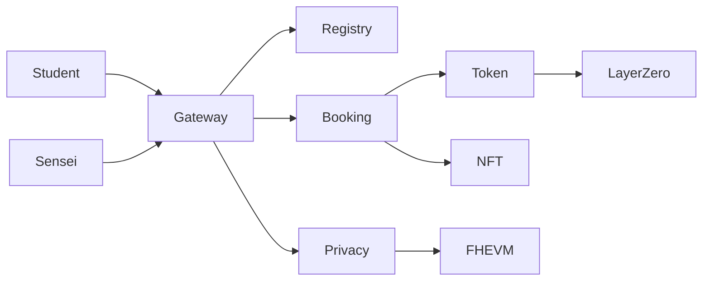

## Simplified System Overview (Preview-Friendly)

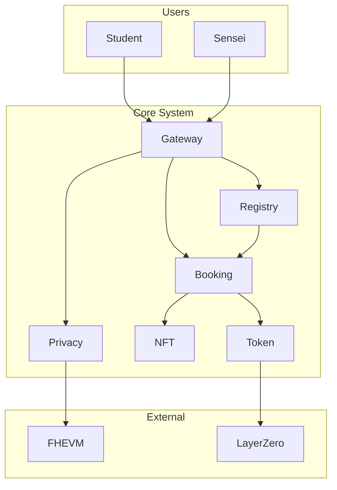

## Simplified Knowledge Session Flow (Preview-Friendly)

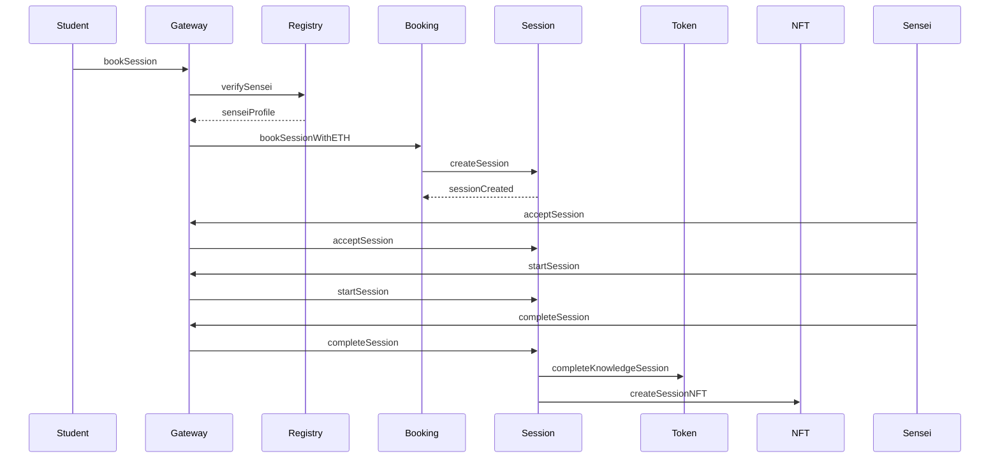

## Overall System Architecture (Complex Flow)

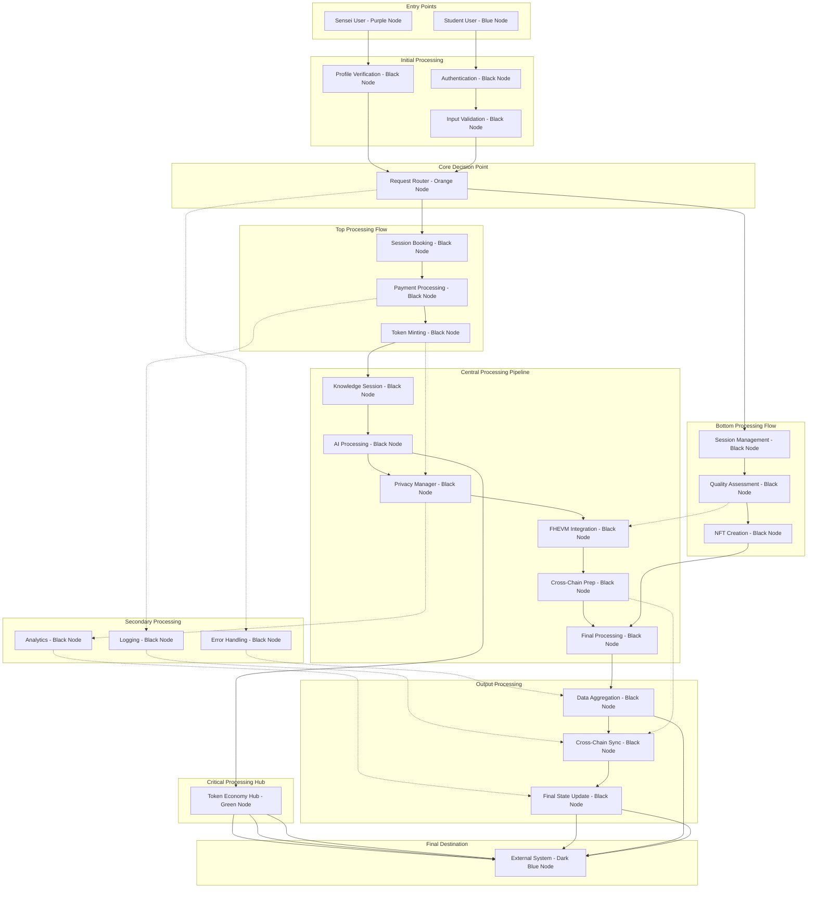

## Smart Contract Interaction Matrix

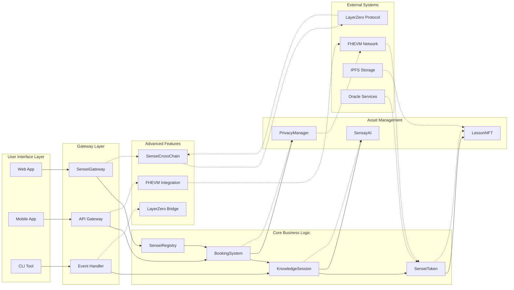

## Knowledge Session Flow (Detailed)

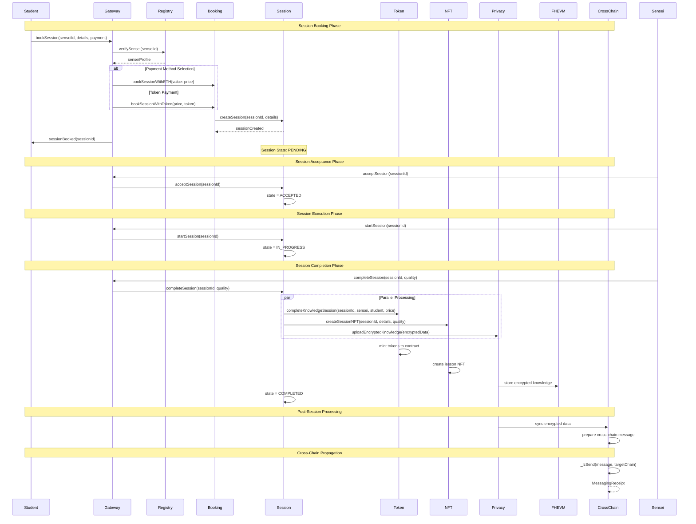

## Token Economy Flow (Complex)

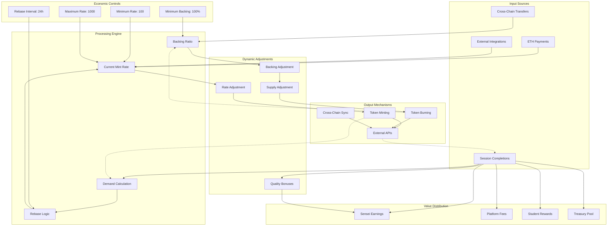

## NFT Creation & Minting Flow (Detailed)

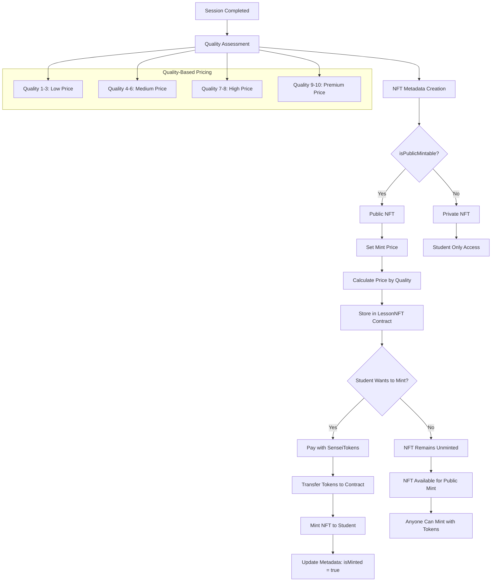

## FHEVM Privacy System (Complex)

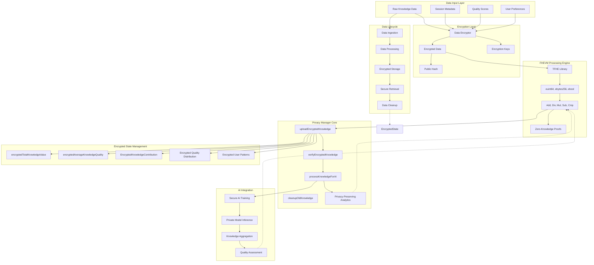

## Cross-Chain Messaging (Detailed)

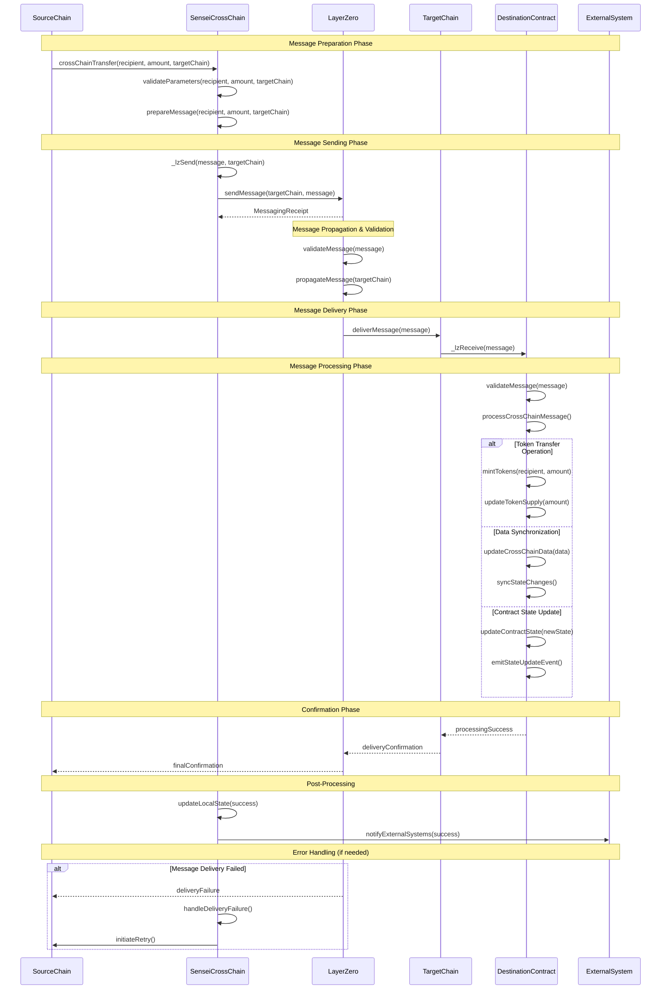

## Security Model (Comprehensive)

```mermaid
graph TB
    subgraph "Access Control Layer"
        Owner[Contract Owner]
        AuthorizedMinters[Authorized Minters]
        AuthorizedBurners[Authorized Burners]
        SenseiOnly[Sensei-Only Functions]
        StudentOnly[Student-Only Functions]
        AdminOnly[Admin-Only Functions]
    end
    
    subgraph "Security Mechanisms"
        ReentrancyGuard[Reentrancy Protection]
        Ownable[Ownership Control]
        Pausable[Emergency Pause]
        RateLimiting[Rate Limiting]
        TimeoutMechanisms[Timeout Mechanisms]
        BlacklistSystem[Blacklist System]
    end
    
    subgraph "Input Validation"
        AddressValidation[Address Validation]
        AmountValidation[Amount Validation]
        StateValidation[State Validation]
        QualityValidation[Quality Validation]
        StringValidation[String Validation]
        ArrayValidation[Array Validation]
    end
    
    subgraph "Economic Security"
        BackingRatio[Backing Ratio Checks]
        MintRateLimits[Mint Rate Limits]
        SessionTimeouts[Session Timeouts]
        PaymentVerification[Payment Verification]
        OverflowProtection[Overflow Protection]
        UnderflowProtection[Underflow Protection]
    end
    
    subgraph "State Machine Security"
        StateTransitions[Valid State Transitions]
        StateValidation[State Validation]
        StateLocking[State Locking]
        StateRollback[State Rollback]
    end
    
    subgraph "Privacy & Encryption"
        DataEncryption[Data Encryption]
        KeyManagement[Key Management]
        AccessControl[Access Control]
        AuditLogging[Audit Logging]
    end
    
    subgraph "Cross-Chain Security"
        MessageValidation[Message Validation]
        SignatureVerification[Signature Verification]
        ReplayProtection[Replay Protection]
        ChainValidation[Chain Validation]
    end
    
    %% Access Control Flow
    Owner --> AuthorizedMinters
    Owner --> AuthorizedBurners
    Owner --> AdminOnly
    
    AuthorizedMinters --> ReentrancyGuard
    AuthorizedBurners --> ReentrancyGuard
    AdminOnly --> Ownable
    
    %% Security Mechanism Flow
    ReentrancyGuard --> InputValidation
    Ownable --> StateMachineSecurity
    Pausable --> EconomicSecurity
    
    %% Input Validation Flow
    AddressValidation --> StateValidation
    AmountValidation --> EconomicSecurity
    QualityValidation --> StateValidation
    
    %% Economic Security Flow
    BackingRatio --> StateMachineSecurity
    MintRateLimits --> EconomicSecurity
    PaymentVerification --> StateMachineSecurity
    
    %% State Machine Flow
    StateTransitions --> StateValidation
    StateValidation --> StateLocking
    StateLocking --> StateRollback
    
    %% Privacy Flow
    DataEncryption --> KeyManagement
    KeyManagement --> AccessControl
    AccessControl --> AuditLogging
    
    %% Cross-Chain Flow
    MessageValidation --> SignatureVerification
    SignatureVerification --> ReplayProtection
    ReplayProtection --> ChainValidation
```

## Smart Contract Relationships

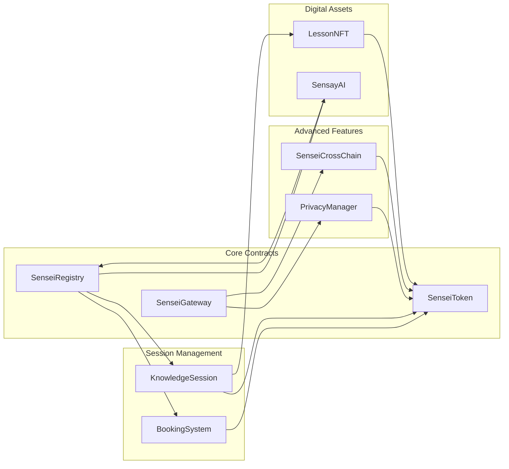

## Token Economy System

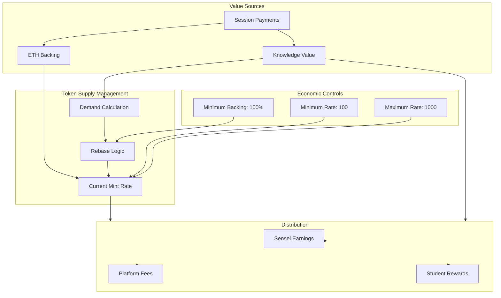

## FHEVM Privacy System

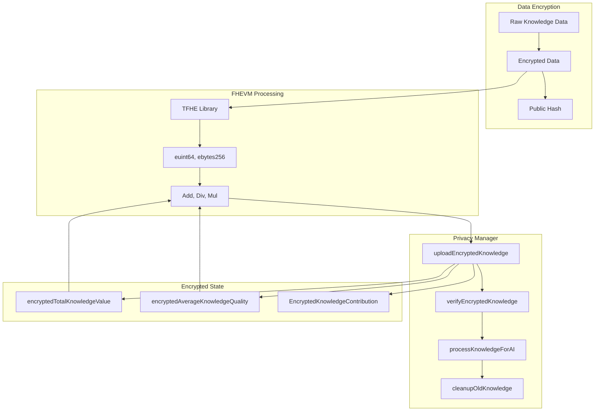

## Cross-Chain Messaging

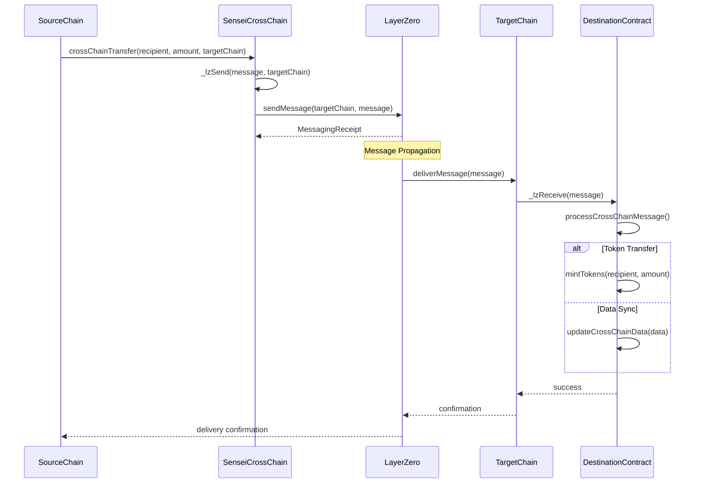

## Security Model

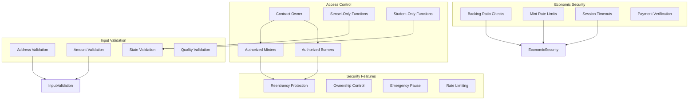

## Data Flow Architecture (Complex)

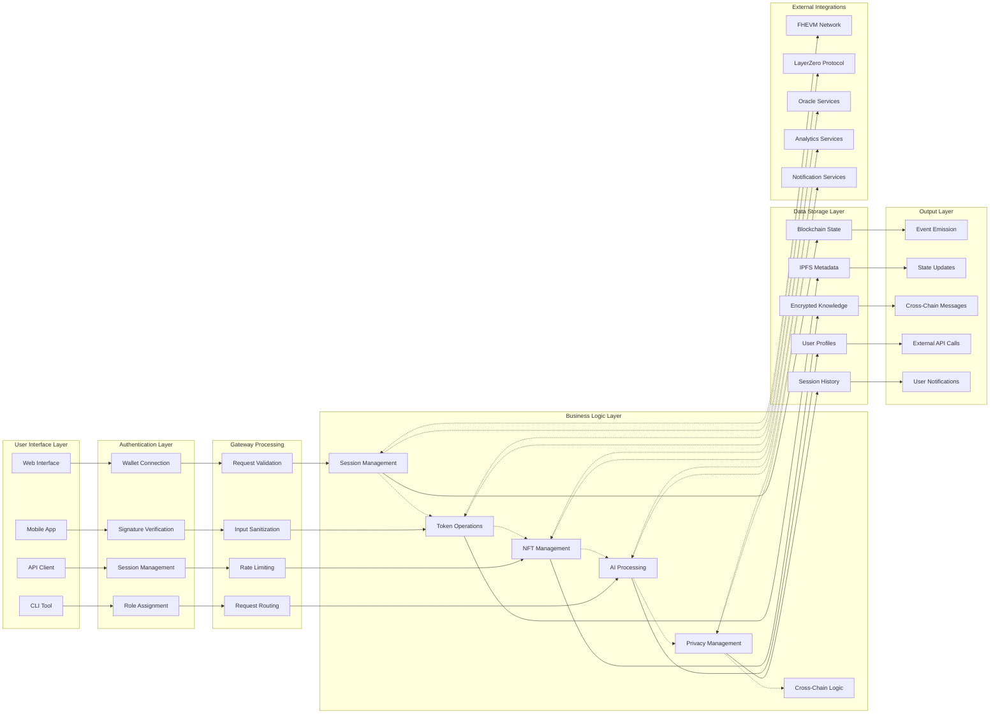

## Economic Incentives (Detailed)

```mermaid
graph TB
    subgraph "Sensei Incentives"
        SessionPayments[Session Payments]
        QualityBonuses[Quality Bonuses]
        Reputation[Reputation Building]
        TokenRewards[Token Rewards]
        NetworkEffects[Network Effects]
        CrossChainRewards[Cross-Chain Rewards]
    end
    
    subgraph "Student Incentives"
        KnowledgeAccess[Knowledge Access]
        NFTOwnership[NFT Ownership]
        TokenEarnings[Token Earnings]
        QualityAssurance[Quality Assurance]
        LearningProgress[Learning Progress]
        CommunityAccess[Community Access]
    end
    
    subgraph "Platform Incentives"
        PlatformFees[Platform Fees]
        NetworkGrowth[Network Growth]
        DataValue[Data Value]
        CrossChainFees[Cross-Chain Fees]
        EcosystemExpansion[Ecosystem Expansion]
        InnovationRewards[Innovation Rewards]
    end
    
    subgraph "Economic Mechanisms"
        DynamicMinting[Dynamic Minting Rate]
        RebaseLogic[Rebase Logic]
        BackingRatio[Backing Ratio]
        DemandResponse[Demand Response]
        QualityMultipliers[Quality Multipliers]
        VolumeDiscounts[Volume Discounts]
    end
    
    subgraph "Token Utility"
        PaymentMethod[Payment Method]
        GovernanceRights[Governance Rights]
        StakingRewards[Staking Rewards]
        LiquidityProvision[Liquidity Provision]
        CrossChainBridge[Cross-Chain Bridge]
        DefiIntegration[DeFi Integration]
    end
    
    subgraph "Network Effects"
        UserGrowth[User Growth]
        ContentQuality[Content Quality]
        NetworkLiquidity[Network Liquidity]
        CrossChainAdoption[Cross-Chain Adoption]
        EcosystemPartnerships[Ecosystem Partnerships]
        InnovationAttraction[Innovation Attraction]
    end
    
    %% Primary Incentive Flow
    SessionPayments --> TokenRewards
    QualityBonuses --> TokenRewards
    Reputation --> SessionPayments
    NetworkEffects --> SessionPayments
    
    KnowledgeAccess --> NFTOwnership
    NFTOwnership --> TokenEarnings
    QualityAssurance --> KnowledgeAccess
    LearningProgress --> CommunityAccess
    
    PlatformFees --> NetworkGrowth
    NetworkGrowth --> DataValue
    DataValue --> CrossChainFees
    EcosystemExpansion --> InnovationRewards
    
    %% Economic Mechanism Flow
    DynamicMinting --> DemandResponse
    RebaseLogic --> BackingRatio
    BackingRatio --> DemandResponse
    DemandResponse --> DynamicMinting
    QualityMultipliers --> TokenRewards
    VolumeDiscounts --> TokenEarnings
    
    %% Token Utility Flow
    TokenRewards --> PaymentMethod
    TokenRewards --> GovernanceRights
    TokenRewards --> StakingRewards
    TokenRewards --> LiquidityProvision
    TokenRewards --> CrossChainBridge
    TokenRewards --> DefiIntegration
    
    %% Network Effects Flow
    UserGrowth --> ContentQuality
    ContentQuality --> NetworkLiquidity
    NetworkLiquidity --> CrossChainAdoption
    CrossChainAdoption --> EcosystemPartnerships
    EcosystemPartnerships --> InnovationAttraction
    InnovationAttraction --> UserGrowth
    
    %% Feedback Loops
    TokenRewards -.-> SessionPayments
    TokenEarnings -.-> KnowledgeAccess
    InnovationRewards -.-> EcosystemExpansion
    NetworkLiquidity -.-> TokenRewards
```

